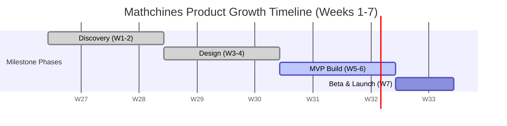
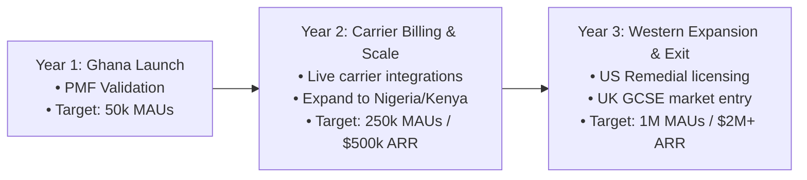

# Mathchines Pitch Decks (Markdown Edition)

This file contains presentation-ready markdown slides for the two Mathchines pitch decks:

1. **Product Pitch Deck (v2.0)** — Focused on user flow, persona mapping, and learning loops.
2. **Investor & Growth Pitch Deck (v1.0)** — Focused on market scaling, carrier distribution, and unit economics.

Use a markdown presentation viewer (like **Marp**, **Slidev**, or the VS Code Markdown Slides extension) or read them directly below.

---

# 1. Product Pitch Deck (v2.0)

_Making Math Enjoyable for Every Student_

---

<!-- slide_number: true -->
<!-- bg: #0b1329 -->
<!-- color: #ffffff -->

# Mathchines

### Making Math Enjoyable for Every Student

- **Curriculum Aligned** · Maps to global and local syllabus engines (GES, CCSS, WAEC, GCSE)
- **Adaptive Engine** · Calibrates practice difficulty in real-time
- **Offline-First** · Fully functional without active cellular data load

---

# The Problem

### Why Mathematics is Feared Globally

- **Curriculum Disconnect**
  - Generic global platforms lack out-of-the-box local syllabus integration (e.g., GES in Ghana, NERDC in Nigeria).
- **Missing Feedback Loop**
  - Static homework leaves errors unexplained, allowing student learning gaps to compound.
- **Math Anxiety**
  - Rigid, repetitive drills trigger stress instead of encouraging conceptual understanding.
- **Connectivity Barriers**
  - Data costs and low-end smartphones lock out students in remote or low-income regions.

> **Presenter Notes:**
> Math is viewed as a high barrier by millions. Traditional classrooms struggle with one-size-fits-all instruction, and existing digital tools fail to adapt to local curricula or survive off-grid connectivity realities. Mathchines changes this equation.

---

# The Solution

### Curriculum-Aligned, Adaptive & Offline-First

| Before Mathchines                              | After Mathchines                                         |
| :--------------------------------------------- | :------------------------------------------------------- |
| **Frustrated & Stuck** · Gaps expand           | **Error Correction Engine** · Step-by-step guidance      |
| **Data Guzzlers** · Requires constant internet | **Offline Sync Mode** · Download once, practice anywhere |
| **Out-of-Sync Content** · Generic syllabi      | **Dual Syllabus Compiler** · GES & Western Common Core   |

> **Presenter Notes:**
> Our solution is built on three pillars: instant local syllabus alignment, real-time adaptive feedback, and a robust offline sync database. We meet the learner exactly where they are, in terms of both curriculum and connectivity.

---

# Primary Personas

### Meeting Learners Where They Are

- **Ama / Nia (12–18 yrs) · The Struggling Student**
  - _Pain Point:_ Feels lost in large classes; lacks personal attention.
  - _Goal:_ Rebuild confidence, explain specific concepts, improve grades.
- **Kofi / Malik (13–18 yrs) · The Self-Directed Learner**
  - _Pain Point:_ General learning apps are too generic or lack target exam focus.
  - _Goal:_ Advance ahead of class curricula, prepare for national exams.
- **Kwame / Fatima (12–16 yrs) · The Low-Connectivity Learner**
  - _Pain Point:_ Expensive mobile data, low-end Android Go smartphone.
  - _Goal:_ Ace BECE/WAEC exams using zero data via offline caching.

> **Presenter Notes:**
> We designed Mathchines around three specific user groups. Ama needs confidence and clear error breakdowns. Kofi wants acceleration and target exam alignment. Kwame represents millions in emerging markets who require high-performance software running on entry-level hardware with spotty connections.

---

# The MVP Student Success Loop

### From Onboarding to Topic Mastery


> **Presenter Notes:**
> The student loop is streamlined for high engagement. Upon onboarding, the curriculum compiler maps their path. An optional diagnostic placement quiz pinpoints gaps. Interactive practice adjusts question difficulty in real time, and any mistake immediately triggers explanatory step-by-step correction.


---

# Roadmap & Go-To-Market

### Discovery to Global Scaling

- **Phase 1: Discovery (Weeks 1–2)** · Syllabus compilation models (GES & CCSS) and design system.
- **Phase 2: Design (Weeks 3–4)** · UI/UX templates, wireframes, and adaptive engine specifications.
- **Phase 3: MVP Build (Weeks 5–6) [In Progress]** · Offline Sync DB, adaptive practice engine, airtime billing API hooks.
- **Phase 4: Beta (Week 7)** · Core testing with students in Ghana and the US.
- **Phase 5: Launch (Week 7)** · Public roll-out in West Africa and North America.
- **Phase 6: Post-MVP (Weeks 8–15)** · 1v1 Arena, parent SMS portals, and Lightning Jams.



> **Presenter Notes:**
> Our roadmap is built on systematic verification. We start with curriculum mapping, build core engines during weeks 5-6 (which we are currently working on), conduct beta validation on low-end hardware, and launch publicly in Week 7, immediately unlocking the mobile airtime billing layer.

---

# MVP Success Metrics

### Key Performance Indicators for Core Validation

- **Learning Engagement & Stickiness**
  - Week 1 User Retention: **≥ 45%** (driven by gamification & streak systems)
  - Daily Active Duration: **15+ Minutes** average active learning focus
- **Academic Performance & Adaptivity**
  - 30-Day Learning Gain: **≥ 22%** average score improvement
  - Adaptive Accuracy Rate: **≥ 80%** correct answer progression
- **Offline Infrastructure Moat**
  - Offline Sessions Share: **≥ 35%** of sessions (validating local cache utility)
  - Delta Sync Success: **100%** database sync of offline practice records

> **Presenter Notes:**
> Our metrics prove both value and viability. We measure Week 1 retention to validate gamification, but the ultimate KPI is a 22% average score increase within 30 days. For infrastructure, targeting a 35% offline session share proves our software reaches low-connectivity students seamlessly.

---

# Join the Revolution

### Making Math Accessible to Every Student Globally

- Bridging curricula across continents.
- Bypassing data caps with offline-first software.
- Democratizing access via mobile airtime payments.

**Mathchines: Anxiety to Achievement.**

---

---

# 2. Investor & Growth Pitch Deck (v1.0)

_Scaling Global Mathematics Literacy via Carrier Integrations_

---

<!-- bg: #061c15 -->
<!-- color: #ffffff -->

# Mathchines

### Scaling Global Mathematics Literacy

- Direct Telco Billing Moats
- Offline-First Software Core
- $45 Billion Addressable SAM

---

# Investment Thesis

### Capturing the Frictionless Path

- **Credit Card Barrier Bypass**
  - Emerging market parents want to pay, but Stripe or App Store recurring card fees fail due to lack of local credit cards. We integrate direct telecom billing (airtime/mobile money), increasing conversion by 5-10x.
- **Data Cost Neutrality**
  - Standard video tutoring demands high broadband. Mathchines partners with telecom operators to zero-rate data usage while offering offline downloads.
- **Proprietary Syllabus Compiler**
  - We map custom national curricula (GES, WAEC, NERDC) into structured adaptive nodes using automated compilation templates, creating an immediate content moat.

> **Presenter Notes:**
> Why now, and why Mathchines? We solve the real barriers to monetization and adoption. Bypassing credit card friction with telco airtime billing and eliminating data fees via carrier zero-rating lets us scale efficiently.

---

# Market Opportunity

### A Triple-Tiered Addressable Market

```
┌──────────────────────────────────────────────┐
│  TAM: $400 Billion (Global EdTech Market)    │
│  ┌────────────────────────────────────────┐  │
│  │ SAM: $45 Billion (Math Tutoring Segment)│  │
│  │ ┌────────────────────────────────────┐ │  │
│  │ │ SOM: $2.5 Billion (Emerging Cohorts)│ │  │
│  │ └────────────────────────────────────┘ │  │
│  └────────────────────────────────────────┘  │
└──────────────────────────────────────────────┘
```

- **SOM Target:** High-growth segments in Sub-Saharan Africa (starting in Ghana, Nigeria, Kenya) and remedial/under-resourced cohorts in North America.

> **Presenter Notes:**
> Our market opportunity scales from a $400B TAM down to a highly reachable SOM of $2.5B. This target captures both value-conscious emerging middle classes and Western remedial school systems.

---

# Unit Economics

### Calibrated Regional Subscription Tiers

#### 1. Africa Micro-Tier

- **Pricing:** GHS 1–2 / day ($0.08 - $0.16 USD)
- **Payment:** Cellular Carrier Balance (Airtime)
- **Access:** Fully Offline, Zero-Rated Data, Curriculum Maps
- **Volume:** High-volume scale, low subscriber acquisition cost (SAC)

#### 2. Western Premium Tier

- **Pricing:** $4.99 / month (USD)
- **Payment:** Standard Card Subscription (Stripe / Apple / Google)
- **Access:** Online/Offline, AI Homework Helper, Parent Progress Portals
- **ARPU:** High blended ARPU, funding core product development

> **Presenter Notes:**
> Our pricing model accounts for local purchasing power. The Western premium tier supports high margins, while the African micro-tier leverages telco channels to capture high transaction volume.

---

# Revenue Projections

### Interactive Growth Simulator

Model projections based on active monthly user scale, conversions, and blended monthly ARPU:

- **Basic Scale Model**
  - 250,000 MAUs · 6.0% Paid Conversion · $2.00 Blended ARPU
  - **Paid Subscribers:** 15,000
  - **ARR Run Rate:** `$360,000`
  - **Implied Valuation (8x SaaS Multiple):** `$2.88 Million`
- **Mid-Term Growth Model**
  - 1,000,000 MAUs · 5.0% Paid Conversion · $2.50 Blended ARPU
  - **Paid Subscribers:** 50,000
  - **ARR Run Rate:** `$1.50 Million`
  - **Implied Valuation (8x SaaS Multiple):** `$12.00 Million`

> **Presenter Notes:**
> By sliding active users and conversion parameters, you see the scaling power of our micro-billing engine. Even with highly conservative blended ARPUs, high subscriber volume generates highly scalable annual run rates.

---

# Go-To-Market

### Telecom Carrier Channels & School Viral Loops

1. **Telco API Hook**
   - Pre-packaged payment agreements with MTN, Telecel, and AirtelTigo.
2. **Zero-Rating Proxy**
   - Cellular operators proxy data usage, removing the data cost barrier for families.
3. **Classroom Viral Loop**
   - Teachers assign curriculum modules and track analytics. Parents receive weekly automated reports via WhatsApp/SMS, driving high referral loops.
4. **Churn Protection**
   - Telecom billing logic auto-renews dynamically in tiny daily chunks, matching families' cash flow cycles.

> **Presenter Notes:**
> Our distribution focuses on high efficiency. Telco channels handle data and billing, and teachers drive organic school referrals. By keeping parent reports on SMS and WhatsApp, we bypass the need for parents to install heavy apps to stay involved.

---

# Technology Moat

### Lightweight Clients & Syllabus Mapping

- **Syllabus Compiler**
  - Automates parsing of national curriculum PDFs into adaptive learning trees within hours.
- **Lightweight Client Core**
  - Optimized Progressive Web App (PWA) with a bundle size of **<3.5MB**. Runs smoothly on budget Android Go devices with 1-2GB RAM.
- **Supabase Delta Sync**
  - Stores user telemetry and quiz metrics locally via IndexDB, syncing in small JSON packets when cellular signals are active.
- **Supabase Authentication Moat**
  - Secure identity mappings with standard Email and Google OAuth integrations, shielded behind Row-Level Security (RLS) data policies.

> **Presenter Notes:**
> Our technology moat is designed for device constraints and security. A sub-3.5MB client runs on low-end hardware, our custom compiler structures content quickly, delta syncing ensures offline progress is uploaded in tiny files when a signal returns, and student records are guarded with secure Supabase authentication.

---

# Document-to-Deck AI Engine

### AI Presentation & Lesson Compiler Moat

- **Marp-Compatible Markdown Parser** · Dynamically turns standard markdown slides into interactive, high-fidelity React screens.
- **Gemini 2.5 Flash API Hook** · Allows teachers to upload textbooks, notes, or lesson guides to compile structured slide decks in seconds.
- **Client-Side Sorter & Copy** · Fully interactive slides player with instant preview, slide management, and clipboard sharing.
- **Interactive UI Injection** · Automatically maps slide content into premium custom interfaces (such as charts, simulators, and steps).

> **Presenter Notes:**
> Educators struggle with building presentations. We have created a custom Document-to-Deck engine. By pairing our dynamic parser with Gemini 2.5 Flash, teachers can turn text documents into interactive web lessons, which acts as a powerful organic acquisition channel.

---

# Funding Request

### The $1.5 Million Seed Round

```
┌──────────────────────────────────────────────────────────┐
│ [██████████████████████] Product Engineering (45% - $675k)│
│ [──────────────] Telecom Integrations (30% - $450k)      │
│ [────────────] Curriculum Maps & Scale (25% - $375k)     │
└──────────────────────────────────────────────────────────┘
```

- **Engineering:** Sync engine optimization, teacher suite, mobile web performance.
- **Telecom:** Direct carrier billing API integration and merchant security.
- **Curriculum:** Expanding maps for Nigeria (WAEC), UK (GCSE), and US (CCSS).
- **Runway:** 18-month operational runway.

> **Presenter Notes:**
> We are raising a $1.5M Seed round. The capital will be split between refining our offline engines (45%), expanding payment integration APIs (30%), and extending curriculum mappings for the UK, Nigeria, and US markets (25%).

---

# Roadmap & Scaling Milestones

### 3-Year Operational Roadmap

- **Year 1 (Ghana Launch)**: PMF validation in West Africa. Target: 50k MAUs.
- **Year 2 (Carrier & Nigeria Scale)**: Live carrier billing integration. Expand to Nigeria/Kenya. Target: 250k MAUs / $500k ARR.
- **Year 3 (Western Expansion & Exit)**: Expand US remedial school licenses and UK GCSE markets. Target: 1M MAUs / $2M+ ARR.



> **Presenter Notes:**
> Our path focuses on capital efficiency. We start by proving retention in Year 1, expand carrier billing and regional footprint in Year 2, and enter the Western school remedial market in Year 3. This positions us for a strong Series A or strategic acquisition.

---

# Partner with Mathchines

### Making Math Enjoyable for Every Student, Anywhere

**Join the Mathchines Seed Round.**

_Contact:_ `investors@mathchines.com` · _Website:_ `mathchines.com/pitch-investor`
