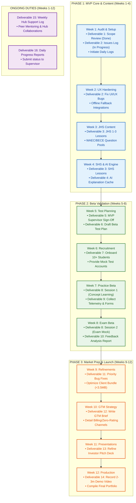

# Project Roadmap 2026: Mathchines

This document outlines the detailed **12-Week Project Roadmap** for **Mathchines** during the **Build with AI Internship Program 2026**. It aligns the product development milestones, beta testing strategy, market launch preparations, and weekly reporting workflows.

---

## 1. Roadmap Overview

The roadmap is structured into four sequential execution phases over a 12-week runway:

1. **Phase 1: MVP Hardening & Content Compilation (Weeks 1–4)**
   * Stabilize the client-side database, expand static curriculum coverage, and optimize the AI explanation engine.
2. **Phase 2: Beta Testing & Quality Validation (Weeks 5–8)**
   * Recruit testing cohorts, execute structured learning sessions, and compile feedback.
3. **Phase 3: Product Iteration & Market Prep (Weeks 9–12)**
   * Implement fixes, draft GTM strategies, refine pitch decks, and produce visual marketing assets.
4. **Phase 4: Ongoing Compliance (Daily & Weekly)**
   * Submit EOD deliverables reports and track hub support activities.

---

## 2. Master Execution Diagram

The diagram below integrates all execution phases, weekly objectives, deliverables, and dependencies into a single visual roadmap:

---

## 4. Work Package Specifications

### Work Package A: MVP Completion (Weeks 1–5)
* **Objective:** Ensure the core learning loop works end-to-end under simulated network constraints.
* **Key Tasks:**
  * Clean up state transitions in the adaptive quiz selector.
  * Integrate offline-resilient error capturing to prevent the frontend crashing during API timeouts.
  * Write full answer explanations for all 40 static practice questions.

### Work Package B: Beta Validation (Weeks 5–8)
* **Objective:** Verify user engagement metrics, math scoring improvements, and offline database caching reliability.
* **Key Tasks:**
  * Draft test cases focusing on Ama (struggling student), Kofi (accelerator), and Kwame (low-connectivity).
  * Instrument local telemetry trackers in localStorage to record streaks, elapsed time, and difficulty progression.
  * Collate findings into a central CSV repository.

### Work Package C: Market Preparation (Weeks 9–12)
* **Objective:** Prepare Mathchines for scale and external communication with stakeholders.
* **Key Tasks:**
  * Polish UI transitions and clean unused imports to ensure fast page load speeds.
  * Structure slides in `PITCH_DECK.md` to be easily readable via markdown deck extensions.
  * Record high-definition screencasts demonstrating the local database syncing capabilities.
