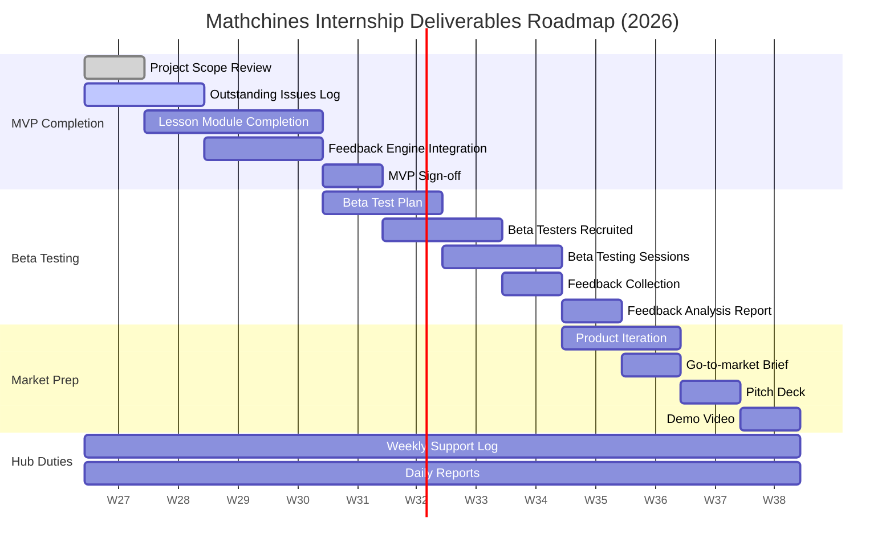

# Project Scope & Internship Roadmap 2026: Mathchines

This document outlines the comprehensive project scope, codebase architecture, and internship roadmap for **Mathchines** during the **Build with AI Internship Program 2026**. It is compiled for **Desmond Appiah** based on the official Student Deliverables Tracker and the current state of the workspace.

---

## 1. Executive Summary & Product Vision

**Mathchines** is a mathematics platform designed to transform math education from a source of anxiety into an enjoyable, rewarding, and accessible learning experience. 

Traditional digital tutoring platforms suffer from four key bottlenecks:
1. **Generic Syllabuses:** Standard programs lack alignment with local curricula (e.g., Ghana's GES, Nigeria's NERDC).
2. **Missing Feedback Loops:** Mistakes go unexplained, allowing learning gaps to compound.
3. **Connectivity Barriers:** Broadband requirements lock out low-infrastructure regions.
4. **Payment Friction:** Lack of credit card penetration bars subscription-based monetization in developing markets.

Mathchines addresses these bottlenecks directly with a curriculum-aligned, adaptive, offline-first, and carrier-billing integrated platform.

### Core Target Personas
* **Ama / Nia (12–18 yrs) — The Struggling Student:** Needs clear step-by-step feedback to rebuild basic confidence.
* **Kofi / Malik (13–18 yrs) — The Self-Directed Learner:** Aims to study ahead of classes and prepare for competitive national entry exams (e.g., BECE, WAEC, GCSE).
* **Kwame / Fatima (12–16 yrs) — The Low-Connectivity Learner:** Relies on entry-level Android devices and requires low-data or zero-data offline operation to study without expensive internet costs.

---

## 2. Core Architecture & Current MVP Implementation

The repository is built on a modern stack optimized for lightweight client performance and rich, interactive experiences.

* **Frontend Framework:** React with Vite
* **Routing System:** TanStack Router (Typesafe routes mapped in [src/routes/](file:///c:/Users/LENOVO/OneDrive/Documents/Mathchines/document-to-web-magic/src/routes))
* **Database & Auth:** Supabase integration (with mock fallbacks for offline-first resilience)
* **AI Engine:** Gemini 2.5 Flash API (invoked via TanStack Start server functions)
* **Styling & Components:** Vanilla CSS combined with custom tailwind directives and Shadcn-based primitives ([components.json](file:///c:/Users/LENOVO/OneDrive/Documents/Mathchines/document-to-web-magic/components.json))

### Key Files in Current Build
* **Syllabus Dataset:** [countriesData.ts](file:///c:/Users/LENOVO/OneDrive/Documents/Mathchines/document-to-web-magic/src/lib/countriesData.ts) mapping national structures (GES, NERDC, GCSE, Common Core) and fallback curriculum tags for over 150 countries.
* **Curriculum Compiler Logic:** [curriculum.ts](file:///c:/Users/LENOVO/OneDrive/Documents/Mathchines/document-to-web-magic/src/lib/curriculum.ts) which handles static topic mapping (Fractions, Algebra, Area & Perimeter, Ratios) and compiles live curriculum rows from Supabase.
* **Interactive Quiz Page:** [learn.quiz.$topicId.tsx](file:///c:/Users/LENOVO/OneDrive/Documents/Mathchines/document-to-web-magic/src/routes/learn.quiz.$topicId.tsx) implementing the adaptive difficulty algorithm (`Foundational` $\leftrightarrow$ `Standard` $\leftrightarrow$ `Challenge`) and connecting directly to the AI Tutor explanation engine.
* **Student/Teacher/Parent Workspace:** [learn.index.tsx](file:///c:/Users/LENOVO/OneDrive/Documents/Mathchines/document-to-web-magic/src/routes/learn.index.tsx) providing structured dashboards for student topic tracking, teacher classroom/student logging, and parent monitoring views.
* **AI Tutor Explanation Hook:** [ai.functions.ts](file:///c:/Users/LENOVO/OneDrive/Documents/Mathchines/document-to-web-magic/src/lib/api/ai.functions.ts) which formats Zod-validated student prompts and queries the Gemini 2.5 Flash API to retrieve custom math clarifications.

---

## 3. Internship Roadmap & Deliverables Tracker

The internship duration is structured around 16 key deliverables, divided into four major work packages: **MVP Completion**, **Beta Testing**, **Market Preparation**, and **Hub Duties**.

### Detailed Deliverables Breakdown

| # | Deliverable | Target Description | Code/Asset Artifacts Affected | Status |
| :--- | :--- | :--- | :--- | :--- |
| **1** | **Project Scope Review** | Review the current client builds, Supabase connection structures, and define the internship path. | `PROJECT_SCOPE.md` | **Completed** |
| **2** | **Outstanding Issues Log** | Document UI inconsistencies, mock database vulnerabilities, offline fallback edge cases, and routing bugs. | `OUTSTANDING_ISSUES.md` | **In Progress** |
| **3** | **Lesson Module Completion** | Expand structured math lessons and practice pools for JHS/SHS levels (focusing on BECE and WAEC examination tags). | [curriculum.ts](file:///c:/Users/LENOVO/OneDrive/Documents/Mathchines/document-to-web-magic/src/lib/curriculum.ts) | *Not Started* |
| **4** | **Feedback Engine Integration** | Clean up worked explanation interfaces and optimize the serverless Gemini 2.5 Flash API connector to handle offline prompts or request rate limits. | [ai.functions.ts](file:///c:/Users/LENOVO/OneDrive/Documents/Mathchines/document-to-web-magic/src/lib/api/ai.functions.ts), [learn.quiz.$topicId.tsx](file:///c:/Users/LENOVO/OneDrive/Documents/Mathchines/document-to-web-magic/src/routes/learn.quiz.$topicId.tsx) | *Not Started* |
| **5** | **MVP Sign-off** | Complete supervisor walkthrough sessions to verify that client routes, dashboards, and AI engines are demo-ready. | Walkthrough sessions | *Not Started* |
| **6** | **Beta Test Plan** | Draft a written testing plan including target demographics (JHS/SHS), test scenarios, success criteria, and feedback loops. | `BETA_TEST_PLAN.md` | *Not Started* |
| **7** | **Beta Testers Recruited** | Onboard a minimum of 10 student testers from local JHS/SHS segments onto the staging client. | Tester database records | *Not Started* |
| **8** | **Beta Testing Sessions** | Run at least 2 structured testing runs (virtual or physical) and log direct user observations. | Observation logs | *Not Started* |
| **9** | **Feedback Collection** | Collate feedback data from forms, surveys, and post-test interviews. | Consolidated CSV/Forms data | *Not Started* |
| **10** | **Feedback Analysis Report** | Summarize major UX gaps, recurring math misunderstandings, and code flaws reported by testers. | `FEEDBACK_ANALYSIS.md` | *Not Started* |
| **11** | **Product Iteration** | Resolve the top priority bugs and implement critical UX changes based on beta tester reports. | Application code modifications | *Not Started* |
| **12** | **Go-to-market Brief** | Write a one-page strategy brief on value proposition, telco zero-rating partnerships, and airtime micro-billing expansion. | `GTM_BRIEF.md` | *Not Started* |
| **13** | **Pitch Deck** | Finalize the presentation-ready slides highlighting the product values (Product Deck v2.0) and growth numbers (Investor Deck v1.0). | [PITCH_DECK.md](file:///c:/Users/LENOVO/OneDrive/Documents/Mathchines/document-to-web-magic/PITCH_DECK.md), [PITCH.md](file:///c:/Users/LENOVO/OneDrive/Documents/Mathchines/document-to-web-magic/PITCH.md) | *Not Started* |
| **14** | **Demo Video** | Record and produce a concise 2-3 minute video showing the onboarding process, offline study, adaptive quizzes, and AI tutoring feedback. | Demo video file | *Not Started* |
| **15** | **Weekly Hub Support Log** | Maintain active logs of mentoring, code collaborations, and general incubator/hub support duties. | Hub support logs | *Not Started* |
| **16** | **Daily Deliverable Reports**| Submit daily end-of-day progress logs to supervisors detailing active commits and roadmap tasks. | EOD reports | *Not Started* |

---

## 4. Key Implementation Priorities & Next Technical Steps

Based on the current state of the workspace, the immediate technical priorities to transition from "MVP Completion" to "Beta Testing" are:

### A. Expand Outstanding Issues Log (Deliverable 2)
* Review and compile UI layouts under low viewport heights.
* Test offline sync stability. The Supabase auth listener needs to gracefully defer queries when client connectivity is completely lost.
* Inspect data payload size constraints to ensure the bundle size stays below **3.5MB** for budget mobile configurations.

### B. Curriculum Scaling (Deliverable 3)
* Incorporate specialized syllabus modules mapping directly to **JHS 3 (BECE)** and **SHS 1** in the local static data ([countriesData.ts](file:///c:/Users/LENOVO/OneDrive/Documents/Mathchines/document-to-web-magic/src/lib/countriesData.ts)).
* Seed comprehensive sets of practice questions covering standard topics like equations, plane geometry, and simple percentages. Ensure questions contain distinct levels of difficulty (`Foundational`, `Standard`, `Challenge`).

### C. Feedback Engine Fine-Tuning (Deliverable 4)
* Improve the client UI in [learn.quiz.$topicId.tsx](file:///c:/Users/LENOVO/OneDrive/Documents/Mathchines/document-to-web-magic/src/routes/learn.quiz.$topicId.tsx) to cache previous AI explanations locally so students do not re-trigger API queries when navigating backwards.
* Introduce rate limit warnings or cache local "common error explanations" for cases where the Gemini API encounters network timeouts.

---

## 5. Verification & Quality Metrics

To ensure a successful MVP launch and transition to beta cohorts, the software will be validated against the following benchmarks:

* **Weekly Retention Target:** $\geq 45\%$ (verified through user streaks and login history tracker tables).
* **Daily Learning Duration:** Average of $15+$ active minutes per student workspace session.
* **Offline-First Resilience:** $\geq 35\%$ session share running without network access, with $100\%$ accuracy in local progress sync.
* **Core Bundle Efficiency:** PWA bundle footprint verified under **3.5MB** total resource footprint.
